# RL-AI System Design & Architecture (`DESIGN.md`)

## 1. Executive Overview

**`rl-ai`** is a high-fidelity reinforcement learning simulation and policy training framework designed to train neural network control policies for physical quadcopters. It serves as the direct simulation counterpart to **`drone-control-center`**, the embedded flight software operating on physical hardware (Raspberry Pi Zero 2 W + Betaflight flight controller).

To ensure zero-shot sim-to-real transfer, the simulation replicates the physical drone's exact mass, motor thrust curves, sensor characteristics, filtering delays, and low-level flight control algorithms.

```
       [ RL Policy (Tactical Level) ]
                     │
       High-Level Action: [-1, 1] (12 Hz)
                     ▼
       [ FlightController (Execution Level) ]
                     │
       Low-Level RC PWM: [1000, 2000] (240 Hz)
                     ▼
       [ PyBullet Physics Engine (Environment Level) ]
         - 475g All-Up Mass
         - LANNRC 1505+ 3750KV Motors (Max 2.118N/motor)
         - 3" Props, 4S LiPo (Hover @ 1550 PWM)
         - Dual VL53L1X ToF + PMW3901 Optical Flow
```

---

## 2. Physical Hardware Model & Calibration

### 2.1 Physical Specifications

| Parameter | Hardware Reality | Simulation Setting (`src/settings.py`) | URDF Link / Tag |
|---|---|---|---|
| **All-Up Weight** | $475\text{ grams}$ | `DRONE_WEIGHT = 0.475` | `body_link` ($0.411\text{kg}$) + $4\times$ rotors ($0.016\text{kg}$) |
| **Motors** | LANNRC 1505 PLUS 3750KV | `3750 KV` | `<gazebo kv="3750" ... />` |
| **Propellers** | 3-inch (3-blade) | $0.0762\text{m}$ diameter | `<gazebo props_diameter="0.0762" ... />` |
| **Battery** | 4S LiPo (14.8V nominal) | $14.8\text{V}$ | `<gazebo voltage="14.8" ... />` |
| **Flight Endurance** | 2 minutes (120s) | `EPISODE_TIME_SEC = 120.0` | `SUB_EPISODE_LIMIT = 1440` |
| **Hover Throttle** | 1550 PWM (55%) | `HOVER_THROTTLE_PWM = 1550` | Balanced at equilibrium |

### 2.2 Thrust Calibration for 1550 PWM Hover Equilibrium

In the physical drone, hover throttle is measured at **1550 PWM** ($55.0\%$ throttle) paired with Betaflight voltage sag compensation. In PyBullet:

1. Total drone weight:
   $$W = m \cdot g = 0.475\text{ kg} \times 9.81\text{ m/s}^2 = 4.65975\text{ N}$$
2. Normalized hover throttle:
   $$\text{throttle\_norm} = \frac{1550 - 1000}{1000} = 0.550$$
3. For 4 motors at level hover:
   $$4 \times (\text{throttle\_norm} \times \text{MAX\_THROTTLE}) = W$$
   $$4 \times 0.550 \times \text{MAX\_THROTTLE} = 4.65975\text{ N}$$
   $$\mathbf{MAX\_THROTTLE = \frac{4.65975}{2.2} \approx 2.11807\text{ N per motor}}$$
4. Total peak thrust at 2000 PWM:
   $$\text{Thrust}_{\text{max}} = 4 \times 2.11807 = 8.472\text{ N} \approx 864\text{ grams}$$
   $$\text{Thrust-to-Weight Ratio (TWR)} = \frac{8.472}{4.660} \approx 1.818 = \frac{1}{0.550}$$

This matches the dynamic thrust characteristics of a micro cinewhoop quadcopter carrying a Raspberry Pi Zero 2 W, camera, and sensors.

---

## 3. Hierarchical Architecture (HRL)

The training pipeline employs **Hierarchical Reinforcement Learning** decoupling high-level policy inference from high-frequency closed-loop motor control:

```mermaid
flowchart TD
    subgraph Level2 ["Level 2: Tactical Policy (RL Agent / HRL Wrapper) @ 12 Hz"]
        Obs["7D Observation Vector [alt, front_dist, sx, sy, vx, vy, goal]"]
        Policy["Actor Network (SAC / PPO)"]
        Round["RoundActionWrapper (Precision: 2 Decimals)"]
        Action["High-Level Kinematic Action [-1, 1] [alt, roll, pitch, yaw]"]
        Obs --> Policy
        Policy --> Round
        Round --> Action
    end

    subgraph Level1 ["Level 1: Execution Layer (FlightController) @ 240 Hz"]
        Slew["Setpoint Slew Ramping (0.35 m/s)"]
        PID_Throt["Throttle PID (Kp=5.2, Ki=1.0, Kd=3.3, Limits: [-0.35, 1.2])"]
        Asymm["Asymmetric Clamp ([-75, +130] PWM)"]
        AntiWindup["Ground Anti-Windup (Freeze integral if z < 0.020m)"]
        RC_Gen["RC Pulse Generator [1000, 2000] PWM"]
        
        Action --> Slew
        Slew --> PID_Throt
        AntiWindup -.->|Enable / Freeze| PID_Throt
        PID_Throt --> Asymm
        Asymm --> RC_Gen
    end

    subgraph Level0 ["Level 0: Simulation Environment (DroneEnv / PyBullet) @ 240 Hz"]
        BetaPIDs["Attitude PIDs (Roll, Pitch, Yaw)"]
        Mixer["Motor Mix & External Force Application"]
        PyBullet["PyBullet Physics (dt = 1/240 s)"]
        Sensors["Sensor Ingestion & Filters (alpha_alt=0.6, alpha_front=0.3)"]
        
        RC_Gen --> BetaPIDs
        BetaPIDs --> Mixer
        Mixer --> PyBullet
        PyBullet --> Sensors
        Sensors -->|Update Full Obs| Level1
        Sensors -->|Every 20 Steps| Level2
    end
```



---

## 4. Component Details

### 4.1 `FlightController` (`src/flight_controller.py`)

A direct port of the hardware-tested controller from `drone-control-center/services/drone-inference/flight_controller.py`:
- **Hover Throttle Baseline:** `1550 PWM` (range `[1341, 1800]`).
- **Asymmetrical PID Correction:**
  - Descent floor: **$-75\text{ PWM}$** (minimum throttle $1475\text{ PWM}$). Prevents ground bouncing, motor cutouts, and vortex ring instability.
  - Climb ceiling: **$+130\text{ PWM}$** (maximum throttle $1680\text{ PWM}$). Provides sufficient headroom for climbs and battery sag compensation.
- **Smooth Setpoint Slew Ramping:** Setpoint rate is clamped to **$0.35\text{ m/s}$** ($0.1167\text{ norm/s}$ at `MAX_ALTITUDE = 3.0m`). Prevents ceiling catapults on large step changes.
- **Ground Unweight Anti-Windup:** Integral accumulation is frozen when altitude is below the ground threshold:
  $$z_{\text{norm}} < \frac{\text{GROUND\_THRESHOLD}}{\text{MAX\_ALTITUDE}} = \frac{0.020\text{m}}{3.0\text{m}} \approx 0.0067$$

### 4.2 `PIDController` (`src/pid_controller.py`)

- **Derivative-on-Measurement:**
  Calculates derivative from $-\frac{\Delta \text{measurement}}{\Delta t}$ rather than error changes, eliminating derivative kicks when the setpoint changes.
- **Low-Pass Filtered Derivative:**
  $$D_t = 0.6 \cdot D_{\text{new}} + 0.4 \cdot D_{t-1}$$
- **Duplicate Frame Handling:**
  Tracks `time_since_last_change` across identical sensor readings and decays derivative by $0.95$ when no new sensor packet arrives.
- **Bidirectional Integral Bounds:**
  Clamped to $[-0.35, 1.2]$ (allowing $-35\text{ PWM}$ downward trim on fresh battery and $+120\text{ PWM}$ upward trim on battery sag).

### 4.3 `DroneHRLWrapper` (`src/drone_hrl_wrapper.py`)

- **Sub-stepping:** Executes $K = 20$ low-level physics steps ($240\text{ Hz}$) per high-level policy step:
  $$f_{\text{policy}} = \frac{240\text{ Hz}}{20} = 12\text{ Hz} \quad (83.3\text{ ms per step})$$
- **Episode Duration:**
  $$\text{SUB\_EPISODE\_LIMIT} = 120\text{s} \times 12\text{ Hz} = 1,440\text{ steps} \quad (28,800\text{ physics steps})$$
- **Axis Locking:** Supports locking roll, pitch, or yaw for curriculum isolation during training.

### 4.4 `DroneEnv` (`src/drone_env.py`)

- **Dynamics:** 6-DOF rigid body simulated with PyBullet, motor thrust applied at the 4 rotor link frames.
- **Angle Mode Stabilization:** Emulates Betaflight angle mode using closed-loop attitude PIDs:
  - Roll PID: $K_p=2.0, K_i=0.1, K_d=0.5$
  - Pitch PID: $K_p=2.0, K_i=0.1, K_d=0.5$
  - Yaw Rate PID: $K_p=2.0, K_i=1.0, K_d=0.0$
- **Sensor Simulation & Filtering:**
  - Downward ToF: Raycast with exponential smoothing $\alpha = 0.6$ (`ALPHA_ALT`).
  - Forward ToF: Raycast along forward orientation with smoothing $\alpha = 0.3$ (`ALPHA_FRONT`).
  - Optical Flow: Simulated ground displacement and linear velocity. Disabled below $0.04\text{m}$ altitude (sensor ground cutoff from `DESIGN.md`), with deadband $0.05$ applied.

---

## 5. Observation & Action Spaces

### 5.1 Observation Space (7-Dimensional Vector)

The observation vector directly mirrors the sensor layout in `drone-control-center`:

| Index | Name | Physical Sensor | Range (Raw) | Range (Obs) | Normalization Formula |
|---|---|---|---|---|---|
| `[0]` | `altitude` | Downward VL53L1X ToF | $0.0 - 3.0\text{ m}$ | $[0.0, 1.0]$ | $z / \text{MAX\_ALTITUDE}$ |
| `[1]` | `front_distance` | Forward VL53L1X ToF | $0.0 - 3.0\text{ m}$ | $[0.0, 1.0]$ | $d / \text{MAX\_FRONT\_DISTANCE}$ |
| `[2]` | `shift_x` | PMW3901 Optical Flow | $-1.0 - 1.0\text{ m}$ | $[-1.0, 1.0]$ | $\Delta x / \text{MAX\_XY\_SHIFT}$ |
| `[3]` | `shift_y` | PMW3901 Optical Flow | $-1.0 - 1.0\text{ m}$ | $[-1.0, 1.0]$ | $\Delta y / \text{MAX\_XY\_SHIFT}$ |
| `[4]` | `velocity_x` | PMW3901 Optical Flow | $-5.0 - 5.0\text{ m/s}$ | $[-1.0, 1.0]$ | $v_x / \text{MAX\_VELOCITY}$ |
| `[5]` | `velocity_y` | PMW3901 Optical Flow | $-5.0 - 5.0\text{ m/s}$ | $[-1.0, 1.0]$ | $v_y / \text{MAX\_VELOCITY}$ |
| `[6]` | `goal_alt` | High-Level Target | $0.0 - 3.0\text{ m}$ | $[0.0, 1.0]$ | $z_{\text{goal}} / \text{MAX\_ALTITUDE}$ |

### 5.2 Action Space (4-Dimensional Vector)

- **Shape:** `Box(-1.0, 1.0, shape=(4,))`
- **Mapping:**
  - `action[0]` $\implies$ Target altitude setpoint ($a_0 \in [-1, 1] \implies z_{\text{norm}} = (a_0 + 1) / 2$).
  - `action[1]` $\implies$ Desired roll angle ($a_1 \in [-1, 1] \implies \text{RC roll} = 1500 + 500 \cdot a_1$).
  - `action[2]` $\implies$ Desired pitch angle ($a_2 \in [-1, 1] \implies \text{RC pitch} = 1500 + 500 \cdot a_2$).
  - `action[3]` $\implies$ Desired yaw rate ($a_3 \in [-1, 1] \implies \text{RC yaw} = 1500 + 500 \cdot a_3$).
- **Quantization:** Wrapped by `RoundActionWrapper(decimals=2)` to simulate real microcontroller numeric precision.

---

## 6. Reward Function & Episode Lifecycle

### 6.1 Reward Shaping

The environment combines potential-based reward shaping with sparse target bonuses:

1. **Potential Function:**
   $$\Phi(s) = -3 \cdot \left( |z - z_{\text{goal}}| + 2 \cdot \sqrt{x_{\text{shift}}^2 + y_{\text{shift}}^2} \right)$$
   Reward per step:
   $$R_t = \gamma \Phi(s_{t+1}) - \Phi(s_t)$$
2. **Sparse Target Bonus:**
   $$R_{\text{sparse}} = +5.0 \quad \text{if } |z - z_{\text{goal}}| < 0.10\text{m} \text{ and } \sqrt{x_{\text{shift}}^2 + y_{\text{shift}}^2} < 0.15\text{m}$$

### 6.2 Termination & Truncation Conditions

An episode **terminates** if:
- **Ceiling violation:** $z \ge \text{MAX\_ALTITUDE} = 3.0\text{m}$ ($z_{\text{norm}} \ge 1.0$).
- **Ground crash:** $z \le \text{MIN\_ALTITUDE} = 0.04\text{m}$ after step 10.
- **Severe tilt:** $|\text{roll}| > 55^\circ$ or $|\text{pitch}| > 55^\circ$.
- **Excessive drift:** $\sqrt{x_{\text{shift}}^2 + y_{\text{shift}}^2} \ge 0.50\text{m}$.

An episode **truncates** if:
- Step count reaches `SUB_EPISODE_LIMIT = 1440` (2 minutes battery endurance).

---

## 7. Model Export & Sim-to-Real Deployment

Trained models are exported via `src/export_utils.py` into multi-format release artifacts:
1. **PyTorch / TorchScript (`.pt`):** Traced actor model.
2. **ONNX (`.onnx`):** Standard Open Neural Network Exchange graph.
3. **LiteRT / TFLite (`.tflite`):** Converted using `TS2EPConverter` and `litert_torch`.

The exported `.tflite` file is copied directly to `drone-control-center/models/master-model.tflite` for low-latency on-device inference via the Pi Zero 2 W's CPU / NPU accelerator.

---

## 8. Verification & Diagnostic Commands

```bash
# 1. Automated Unit & Physical Simulation Tests (8 tests)
PYTHONPATH=src pytest tests/test_hardware_controller.py tests/test_hrl_wrapper_params.py -v

# 2. Attitude Mode Stabilization Batch Test
PYTHONPATH=src python3 tests/test_angle_mode_batch.py

# 3. Model Inference & Flight Loop Verification
PYTHONPATH=src python3 tests/test_inference.py --model-path trained_models/model_phase_4_final_sac.tflite --goal-alt 0.5 --episodes 1

# 4. Drone Visualizer / Headless Test
PYTHONPATH=src python3 tests/test_drone_render.py --headless --max-steps 60
```
